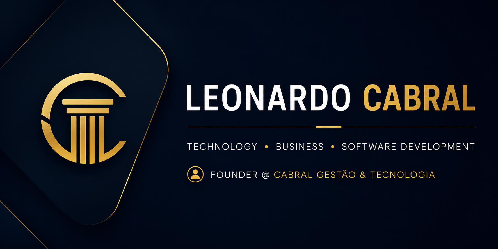

```md
<p align="center">
  
</p>

<h1 align="center">
👋 Olá, eu sou Leonardo Cabral
</h1>

<h3 align="center">
Gerente Administrativo • Fundador da Cabral Gestão & Tecnologia
</h3>

<p align="center">
Tecnologia • Gestão • Desenvolvimento de Software • Inteligência Artificial
</p>

---

# 🚀 Sobre mim

Sou estudante de **Análise e Desenvolvimento de Sistemas (FIAP)** e **Ciências Contábeis (UNASP)**.

Atuo na área de gestão administrativa e atualmente estou expandindo minha carreira para desenvolvimento de software, automação de processos, inteligência artificial e transformação digital.

Meu objetivo é unir **tecnologia, estratégia e gestão** para desenvolver soluções que gerem impacto real para empresas e pessoas.

---

# 💻 Tecnologias

<p align="center">


</p>

---

# 📚 Atualmente estudando

- Java
- Spring Boot
- React
- APIs REST
- Banco de Dados
- Engenharia de Software
- Inteligência Artificial
- Git & GitHub

---

# 🚀 Projetos

## 💰 FreeFlow

Plataforma inteligente de gestão financeira baseada em Open Finance.

Tecnologias:

- Java
- Spring Boot
- React
- Oracle Database

Principais funcionalidades:

- Dashboard Financeiro
- Controle de Receitas
- Controle de Despesas
- Metas Financeiras
- Investimentos
- Cartões
- Perfil
- Open Finance

---

## 🎓 Projeto Imersão Alura

Projeto desenvolvido durante a Imersão da Alura.

Tecnologias:

- HTML
- CSS
- JavaScript

---

## 🏢 Cabral Gestão & Tecnologia

Projeto pessoal voltado para:

- Consultoria
- Automação
- Desenvolvimento
- Organização de processos
- Soluções para empresas

---

# 🎯 Objetivos para 2026

- Concluir ADS na FIAP
- Concluir Ciências Contábeis na UNASP
- Especialização em Inteligência Artificial
- Expandir a Cabral Gestão & Tecnologia
- Construir um portfólio profissional
- Contribuir em projetos Open Source

---

# 📈 Estatísticas

<p align="center">


</p>

---

# 🔥 Contribuições

<p align="center">


</p>

---

# 🌎 Contato

<p align="center">

<a href="https://www.linkedin.com/in/leonardo-cabral-ab0496b7">

</a>

<a href="https://www.instagram.com/cabraliprime">

</a>

<a href="mailto:leonardocabral_1@hotmail.com">

</a>

</p>

---

<p align="center">

⭐ Obrigado por visitar meu perfil!

Sempre aberto para aprender, colaborar e desenvolver soluções que unem tecnologia, gestão e inovação.

</p>
```
